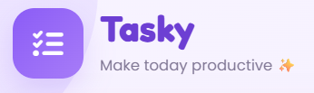

# ✨ Tasky – To-Do List Web App

<p align="center">
  
</p>

<p align="center">
  A modern, responsive and interactive To-Do List Web Application built using HTML, CSS and Vanilla JavaScript.
</p>

---

## 📌 About The Project

**Tasky** is a responsive To-Do List web application developed as part of my **Web Development Internship**.

The application provides users with a simple and interactive way to organize their daily tasks. It features a soft purple and lavender theme with a playful cartoon-inspired design, making task management simple and engaging.

---

## ✨ Features

- ➕ Add new tasks
- ✅ Mark tasks as completed
- 🗑️ Delete tasks
- 🧹 Clear completed tasks
- 📊 Real-time task statistics
- ⏰ Live clock and date
- 💾 Tasks saved using Local Storage
- ⌨️ Press Enter to add tasks
- 📱 Fully responsive design
- 🎨 Soft purple and lavender theme
- 🧸 Cartoon-inspired UI elements
- ⚡ Instant updates without page reload

---

## 🖥️ Project Preview

### Desktop View

<p align="center">
  
</p>

---

## 🛠️ Technologies Used

| Technology | Purpose |
|------------|---------|
| HTML5 | Website structure |
| CSS3 | Styling and responsive design |
| JavaScript | Application functionality |
| Flexbox | Layout |
| CSS Grid | Responsive sections |
| Local Storage | Persistent task data |
| Font Awesome | Icons |
| Google Fonts | Typography |

---

## 📂 Project Structure

```text
Tasky/
│
├── index.html
├── style.css
├── script.js
├── assets/
│   └── tasky-preview.png
└── README.md
